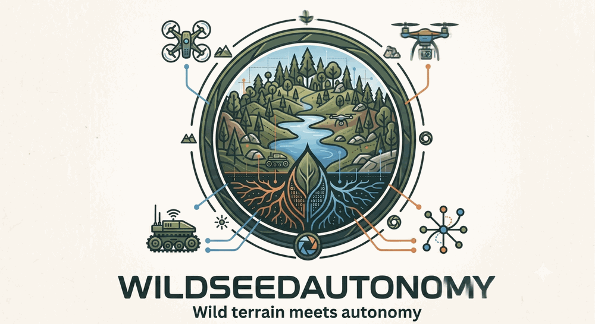
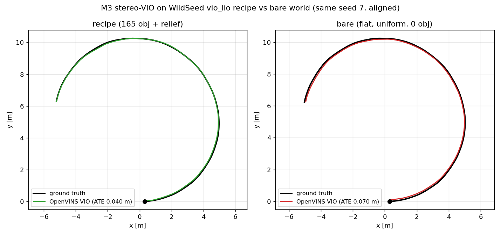

<p align="center">
  
</p>

# WildSeedAutonomy

**Wild terrain meets autonomy: edge sensor fusion + GPS-denied localization,
validated on seeded procedural Gazebo worlds. ROS 2, fully Dockerized.**

A ROS 2 Jazzy + Gazebo Harmonic stack whose hand-rolled EKF/UKF fuses lidar/visual
odometry, IMU, and GNSS — validated on byte-identical wild-terrain worlds served
per seed by the [WildSeed](https://github.com/ricardodeazambuja/WildSeed) generator
(the *WildSeed* worlds + the *autonomy* stack = the name). Design and rationale live
in [`docs/PLAN.md`](docs/PLAN.md).

> **Status:** see [`docs/status-and-testing.md`](docs/status-and-testing.md) — the
> live milestone table, the tiered testing manual, and the per-milestone
> verification log. (Headline so far: infra, teleop, the EKF core, stereo VIO
> sim-first, and the GPS-denied drift→reacquire keystone are done, laptop-verified.)

<p align="center">
  
</p>

*M3 stereo-VIO (OpenVINS + `ego_localizer`) driven over a **seeded** WildSeed
`vio_lio` recipe world vs a same-seed bare/uniform world. The recipe's steered
landmark density + drivable relief cut VIO drift ~⅓ (raw-OpenVINS ATE 0.092 m bare
→ 0.063 m recipe, consistent across 2 runs); RTF holds ≈0.99 under the full node
graph. Full method
+ numbers + the knob sweep: [`results/vio_lio_recipe_eval.md`](results/vio_lio_recipe_eval.md).*

## What's here

| Path | Purpose |
|---|---|
| `docker/` | `Dockerfile.sim` (Gazebo+RViz), `Dockerfile.fusion` (perception/ML), `compose.yaml`, `cyclonedds.xml` |
| `scripts/` | `deploy.sh` (lifecycle, incl. `viz`/`teleop`/`estop`), `remote.sh` (drive the server sim + local RViz from the laptop), `check_host.sh`, `diag_sim.sh`, `demo_n1_teleop.sh` + `n1_drive.py` + `n1_worker.sh` (N1 teleop demo), `plot_trajectory.py`, `expt_gz_ros2_control.sh` |
| `ros2_ws/src/fusion_core/` | ROS-free EKF library (numpy) + pytest — the shared filter `ego_localizer`/`object_tracker` wrap (PLAN M2) |
| `ros2_ws/src/ego_localizer/` | ego-pose EKF node wrapping `fusion_core` (fuses IMU + odometry → `/ego_localizer/odom`); verified live on the sim (PLAN M3 foundation) |
| `ros2_ws/src/eval_tools/` | ROS-free ATE/RPE metrics + `evaluate` chart CLI — the money-chart backbone for every dataset/sim milestone (PLAN §6) |
| `ros2_ws/src/sensing_bringup/config/robot.yaml` | Clearpath Husky: Ouster OS1 + OAK-D stereo + Microstrain IMU |
| `ros2_ws/src/sensing_bringup/launch/husky_sim.launch.py` | robust event-driven headless Husky bringup (gz server-only + condition waits) |
| `ros2_ws/src/gz_lidar_timestamp/` | node: appends per-point `time`/`t` to the gz lidar cloud so odometry can deskew |
| `ros2_ws/src/sensing_bringup/worlds/` | `smoke.sdf` — the minimal headless-render smoke world |
| `docs/` | **all documentation** — start at the [index](docs/README.md): the [PLAN](docs/PLAN.md), [status + testing manual](docs/status-and-testing.md), operations, debugging lore, hardware guides |
| `.env.example` | per-host config (copied to `.env` by `deploy.sh init`) |
| `*.py` | real OAK-D probes (separate from the sim path — guide: [`docs/oak-d-lite-guide.md`](docs/oak-d-lite-guide.md)) |

## Quickstart (laptop **or** server — Docker is the only prerequisite)

```bash
./scripts/deploy.sh check          # verify Docker + NVIDIA GPU passthrough
./scripts/deploy.sh init           # write .env, tuned to this host (edit ROLE)
./scripts/deploy.sh build          # build sim + fusion images  (~15 GB pull)
./scripts/deploy.sh smoke          # prove cross-container DDS  (talker→listener)
./scripts/deploy.sh render         # prove headless GPU render  (smoke world / EGL)
./scripts/deploy.sh up compute     # Clearpath Husky in the off-road "pipeline" world + fusion
```

The simulated robot is a Clearpath **Husky A200** (Ouster OS1 lidar on top,
OAK-D stereo camera, Microstrain IMU) in the outdoor **`pipeline`** world —
configured in `ros2_ws/src/sensing_bringup/config/robot.yaml`.

## Two deployment topologies, one image set

The Dockerfiles are identical across machines; only `.env` (`ROLE`) differs:

- **Laptop-only (the default):** `ROLE=all` — sim + fusion + GUI all on one box.
  Nothing else to configure; DDS and gz-transport are localhost. This is what
  `deploy.sh init` writes by default.
- **Server + laptop:** `ROLE=compute` on the server (headless sim + fusion on the
  GPU), `ROLE=gui` on the laptop (RViz / Gazebo GUI render locally over DDS &
  gz-transport). Only needed if you have a *separate* GPU box; driven from the
  laptop with `scripts/remote.sh`. See [`docs/headless-gui.md`](docs/headless-gui.md).

### Visualize

**Laptop-only (workflow A) — the single-box default:**
```bash
./scripts/deploy.sh viz       # sim LOCAL + RViz + Gazebo GUI, all on this box
./scripts/deploy.sh teleop    # drive it (keyboard)
./scripts/deploy.sh down      # stop everything
```
Needs the sim image built once (`./scripts/deploy.sh build husky`). The GUI services
mount `/dev/dri` + request the NVIDIA `graphics` caps for hardware GL (works on the
hybrid Intel+NVIDIA laptop — X on the iGPU, GL on the dGPU).

**Server + laptop (workflow B) — only if you have a separate GPU server:**
```bash
./scripts/remote.sh viz       # sim on the SERVER + RViz locally (over DDS)
./scripts/remote.sh teleop    # drive it;   ./scripts/remote.sh viz-stop  stops both
```
(B) needs the laptop and server on the same `ROS_DOMAIN_ID` and LAN multicast
(RViz-over-DDS); the cross-host Gazebo GUI needs extra gz-transport config, so (B)
is RViz-only. Set `SENSING_SERVER` in `.env`. `remote.sh` refuses to run (with a
pointer back here) if no server is reachable.

GPU rendering is **OpenGL/EGL**, so the sim/GUI images pin no CUDA. CUDA only
enters the optional ML stack (`WITH_TORCH=1`, `TORCH_VARIANT`, default `cu121`),
which works on both driver 535 (laptop) and 595 (server).
