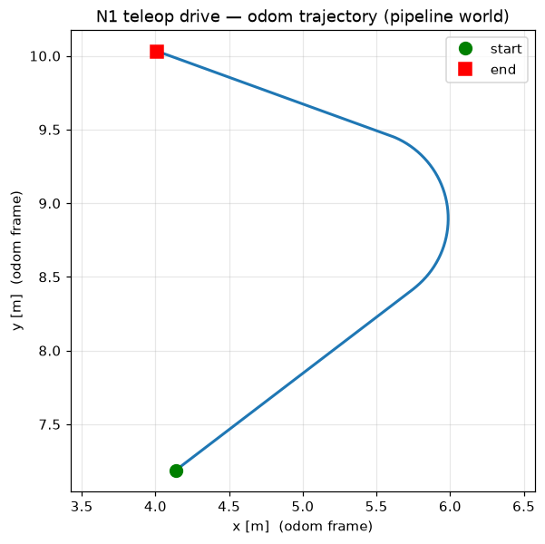

# N1 — Teleoperation + e-stop (the first control mode)

The first of the three operator control modes (PLAN §18). **Status: done & verified.**
Drive the headless Husky over keyboard/SSH through `twist_mux`, with a working
emergency stop. Reproduce with `./scripts/demo_n1_teleop.sh`.



*Odom trajectory from one demo run (forward → arc-left → forward), the headless
substitute for a "drive-around clip". For live video, view odom/RViz from the
laptop over DDS ([`headless-gui.md`](headless-gui.md)).*

## The teleop path
```
keyboard (teleop_twist_keyboard, stamped:=true frame_id:=base_link)
  └─ /a200_0000/joy_teleop/cmd_vel   (TwistStamped)
       └─ twist_mux  (input "joy", priority 10)
            └─ /a200_0000/platform_velocity_controller/cmd_vel
                 └─ diff_drive_controller → wheels → /a200_0000/platform/odom
```
- Interactive teleop: `./scripts/deploy.sh teleop` (use `ssh -t` over SSH, or run on
  the laptop). It runs `teleop_twist_keyboard` remapped to `joy_teleop/cmd_vel`.
- `twist_mux` inputs (from `clearpath_control/config/twist_mux.yaml`): `rc` (12),
  `joy` (10), `interactive_marker` (8), `external` `cmd_vel` (1). Higher wins.

### In-RViz teleop (no extra terminal)

`husky.rviz` carries an **InteractiveMarkers** display so you can drive by dragging a
marker in the 3-D view — no second terminal, no keyboard node. The path reuses the
`interactive_marker` twist_mux input above:
```
drag marker in RViz  ──(feedback)──▶  twist_server_node (interactive_marker_twist_server,
                                       runs WITH the robot — Clearpath platform bringup)
   └─ /a200_0000/twist_marker_server/cmd_vel  (TwistStamped)
        └─ twist_mux  (input "interactive_marker", priority 8)  ──▶  wheels
```
- RViz only **renders + drags** the marker (display "Teleop (drag to drive)"); the
  server node already runs with the husky stack, so nothing extra to launch. Use the
  **Interact** tool (toolbar / `i`) to grab it — drag the `move_x` arrow for
  forward/back, the `rotate_z` ring to turn. (Controls are `always_visible:false`, so
  they only render with the Interact tool active.)
- **The namespace split (the gotcha that made the marker move but the robot not):**
  Clearpath's `twist_server_node` serves `GetInteractiveMarkers` under
  **`/a200_0000/twist_server`** but puts its `update`/`feedback`/`cmd_vel` topics under
  **`/a200_0000/twist_marker_server`**. So RViz's display namespace must be
  `…/twist_server` (else the arrows never appear), but its drag **feedback** must reach
  `…/twist_marker_server/feedback` (else the marker moves but the robot doesn't). The
  compose `rviz` command remaps `twist_server/{update,feedback} →
  twist_marker_server/{…}` to bridge the two. Diagnosed by feeding the node synthetic
  `InteractiveMarkerFeedback` on `…/twist_marker_server/feedback` → robot drove
  1.04 → 2.20 m, proving the node's drag→cmd_vel logic was fine and only the wiring
  was off.
- Caveat: priority 8 < `joy` (10), so an active keyboard/joy teleop overrides the
  marker. Release it (zero twist) and the marker takes over again.
- **Startup delay:** after a fresh `deploy.sh viz`/`up`, wait ~20–30 s before teleop
  responds — the Husky's controllers load a little after spawn (the robot won't move
  until `/a200_0000/platform/odom` is flowing at ~10 Hz). Not teleop-specific.
- Status: **verified interactively** — dragging the marker in RViz drives
  the sim Husky end-to-end from a clean `down`→`up` boot. To use it: activate the
  **Interact** tool (`i`), grab the `move_x` arrow / `rotate_z` ring at the robot.

## The e-stop (and "deadman")
Clearpath's `twist_mux` already ships the e-stop as a **lock**, so we wire/verify it
rather than build one:

| lock | topic | type | priority |
|---|---|---|---|
| `e_stop` | `/a200_0000/platform/emergency_stop` | `std_msgs/Bool` | 255 |
| `safety_stop` | `/a200_0000/platform/safety_stop` | `std_msgs/Bool` | 254 |

**Behavior (verified on the running sim):** publishing `true` engages the lock, which
**mutes every cmd_vel input** (priority 255 is above all of them); the robot then
stops via the diff_drive `cmd_vel` timeout — an **input lockout + brief coast**, not
an active brake. The lock must be **held** (heartbeat) to stay engaged; publish a
sustained **`false`** to release. Engaging it halts an *actively commanded* teleop
(priority 10), and the robot resumes the instant it's released.

```bash
./scripts/deploy.sh estop on     # holds the stop (Ctrl-C, then 'estop off' to release)
./scripts/deploy.sh estop off     # releases — robot can drive again
```

**Deadman scope (decision):** for keyboard/SSH, the N1 safety primitive is this
**latching-style e-stop lock**, backed by the diff_drive **`cmd_vel_timeout` (0.5 s)**
— if the teleop publisher stops sending (process killed / stops publishing / you stop
pressing keys), the last command expires and the robot ramps to a stop (verified: stop
publishing → vx 0.50 → 0.00 over ~3 s, the ramp bounded by the 1.0 m/s² accel limit).
This timeout only works because the teleop service now runs **`use_sim_time:=true`**
(see the timestamp section below) — with the old wall-time stamps the command never
expired and a single keypress drove the robot until it hit a wall. A true
*hold-to-drive* deadman button belongs to a joystick mode and is **deferred** (it
needs `joy`/`teleop_twist_joy`, not keyboard).

## ⚠️ The timestamp gotcha (why `ros2 topic pub` "randomly" doesn't drive)
The `diff_drive_controller` runs on **sim time** (`use_sim_time`) and **drops
commands whose `header.stamp` is too old** — it checks `sim_now − stamp > timeout`.
Three stamp sources, three outcomes (all verified):

| publisher | stamp | `sim_now − stamp` | result |
|---|---|---|---|
| `ros2 topic pub` | **0** | `= sim_now` → exceeds timeout once sim time > ~0.5 s | **dropped** (only "works" right after a fresh up) |
| `teleop_twist_keyboard`, **wall** stamp (old, `use_sim_time` off) | ~1.78e9 | huge **negative** (future-dated) → never "too old" | accepted, but **never expires → drives forever** |
| `teleop_twist_keyboard` (the `teleop` service, **`use_sim_time:=true`** — current) | **sim now** | ≈ 0, grows past timeout when you stop | **accepted, and expires** → robot halts ~0.5 s after you stop |
| `scripts/n1_drive.py` (`use_sim_time:=true`) | **sim now** | ≈ 0 | **accepted** (the correct way) |

**The takeaway: drive a `use_sim_time` controller from a `use_sim_time` publisher** so
stamps track sim time — then commands are accepted *and* the `cmd_vel_timeout` works
(the robot stops when you stop). `ros2 topic pub` (stamp 0) is rejected once sim time
passes the timeout; the old wall-time teleop was accepted but **never expired** (the
"drives forever" bug, now fixed by `use_sim_time:=true` on the teleop service). That
fix relies on the bridged `/clock` reaching the teleop container — **verified** it does
over host-net DDS; if `/clock` ever dies the node would stamp 0 and nothing moves. (The
e-stop lock topics are `std_msgs/Bool`, no stamp, so they're fine over `ros2 topic pub`.)

## Reproduce
```bash
./scripts/demo_n1_teleop.sh          # up → drive a path → e-stop test → CSV + PNG
#   results/n1_trajectory.csv, results/n1_trajectory.png ; prints "N1 ... PASS"
```
The demo asserts: drives (v≈0.5) → e-stop halts active teleop (v≈0) → resumes
(v≈0.5), the trajectory was recorded, and **no rogue publisher nodes survive**
(see the rogue-node / startup-order / timestamp caveats in
[`sim-debugging-notes.md`](sim-debugging-notes.md)).
